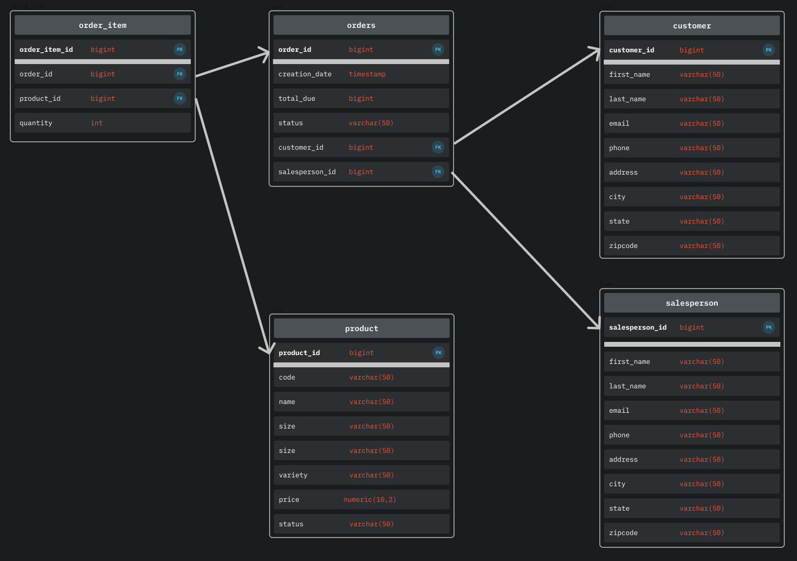

# Introduction
This application aims to use the JDBC API to execute queries on a Docker-provisioned PostgreSQL database.
The database had several CRUD (Create, Read, Update, Delete) operations performed on the database.
This application utilizes the following technologies: Java, PostgreSQL, Docker, Maven, Git, IntellijIDE.

# Implementaiton

## ER Diagram
The following diagram shows the tables that are in the database and the relationships between them.

 

## Design Patterns

Data Access Object (DAO) and Repository design patterns are two widely used database access patterns in java. In this application, the DAO pattern is utilized.

The Data Access Object pattern is a structural pattern that separates the application/business layer from the persistence layer.

The API allows these layers to adapt and evolve independently of one another. This independence provides a great deal of flexibility  and stability.
# Test
Manual testing was used to test the methods, execute the statements, and display results.To check that the CRUD methods are updating the database, I connected to the PSQL using the terminal to verify that the java code was working correctly 